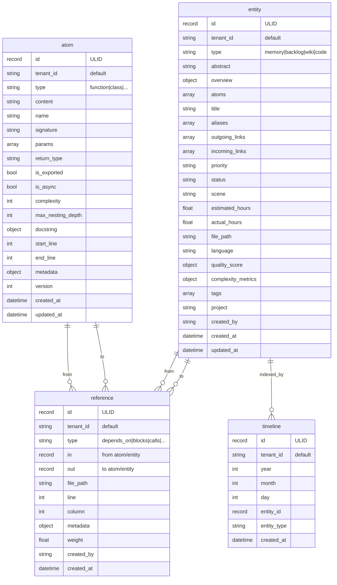
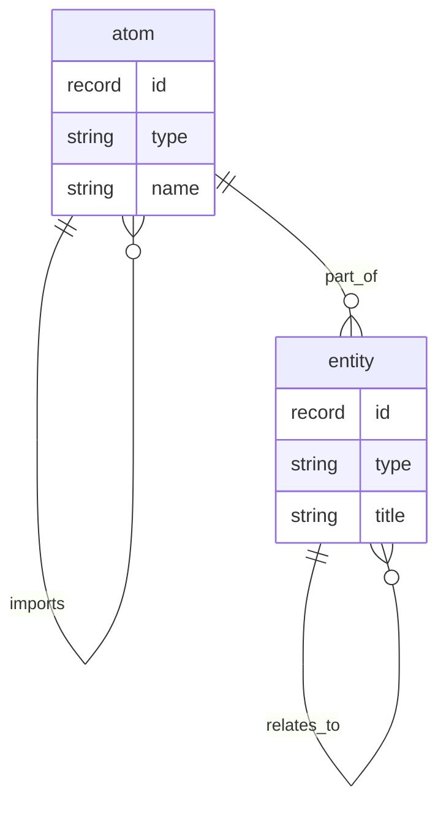

# SurrealDB Schema v3.2 完整定义

> **版本**: v3.2.0  
> **日期**: 2026-04-10  
> **状态**: 实施版  
> **SurrealDB 版本**: 3.0+  
> **Python SDK**: 1.0.8

---

## 目录

1. [Schema 概览](#1-schema-概览)
2. [核心表定义](#2-核心表定义)
3. [辅助表定义](#3-辅助表定义)
4. [索引策略](#4-索引策略)
5. [事件与函数](#5-事件与函数)
6. [ChangeFeed 配置](#6-changefeed-配置)
7. [多租户预留](#7-多租户预留)
8. [迁移脚本](#8-迁移脚本)

---

## 1. Schema 概览

### 1.1 设计目标

v3.2 Schema 设计遵循以下原则：

| 原则           | 说明                                       |
| -------------- | ------------------------------------------ |
| **分层存储**   | L0/L1/L2 三层内容分离                      |
| **图关系原生** | 使用 SurrealDB RELATE 语法                 |
| **多租户预留** | tenant_id 字段预留，SDK 2.0 后启用物理隔离 |
| **ChangeFeed** | 7天变更追踪，支持实时同步                  |
| **性能优化**   | 复合索引、覆盖索引策略                     |

### 1.2 表清单

| 表名        | 类型     | 说明                              | ChangeFeed |
| ----------- | -------- | --------------------------------- | ---------- |
| `atom`      | NORMAL   | 原子级数据（函数、类、任务等）    | ✅ 7d      |
| `entity`    | NORMAL   | 实体级数据（记忆、Backlog、Wiki） | ✅ 7d      |
| `reference` | RELATION | 原子/实体间关系                   | ✅ 7d      |
| `timeline`  | NORMAL   | 时间线索引                        | ❌         |
| `stats`     | NORMAL   | 统计信息                          | ❌         |
| `project`   | NORMAL   | 项目元数据                        | ❌         |
| `config`    | NORMAL   | 系统配置                          | ❌         |

---

## 2. 核心表定义

### 2.1 Atom 表

```sql
-- ============================================
-- Atom 表 - 原子级数据存储
-- 存储：函数、类、接口、导入、目标、范围、任务、笔记
-- ============================================

DEFINE TABLE atom TYPE NORMAL SCHEMAFULL CHANGEFEED 7d INCLUDE ORIGINAL;

-- 主键（使用 ULID 格式：atom:01HQ...）
DEFINE FIELD id ON atom TYPE record;

-- v3.2: 多租户预留字段（单租户时默认 "default"）
DEFINE FIELD tenant_id ON atom TYPE string DEFAULT 'default';

-- 类型枚举
DEFINE FIELD type ON atom TYPE string
    ASSERT $value IN [
        'function',    -- 函数
        'class',       -- 类
        'interface',   -- 接口
        'import',      -- 导入
        'goal',        -- 目标
        'scope',       -- 范围
        'task',        -- 任务
        'note'         -- 笔记
    ];

-- 内容（函数源码、任务描述等）
DEFINE FIELD content ON atom TYPE string;

-- 状态（主要用于 task 类型）
DEFINE FIELD status ON atom TYPE option<string>
    ASSERT $value == NONE OR $value IN ['pending', 'done', 'blocked'];

-- ============================================
-- 代码特有字段（Function/Class/Interface）
-- ============================================
DEFINE FIELD name ON atom TYPE option<string>;
DEFINE FIELD signature ON atom TYPE option<string>;
DEFINE FIELD params ON atom TYPE option<array>;
DEFINE FIELD return_type ON atom TYPE option<string>;
DEFINE FIELD is_exported ON atom TYPE option<bool>;
DEFINE FIELD is_async ON atom TYPE option<bool>;
DEFINE FIELD complexity ON atom TYPE option<int>;
DEFINE FIELD max_nesting_depth ON atom TYPE option<int>;
DEFINE FIELD docstring ON atom TYPE option<object>;
DEFINE FIELD start_line ON atom TYPE option<int>;
DEFINE FIELD end_line ON atom TYPE option<int>;

-- ============================================
-- 通用字段
-- ============================================
DEFINE FIELD metadata ON atom TYPE option<object> DEFAULT {};
DEFINE FIELD version ON atom TYPE int DEFAULT 1;
DEFINE FIELD created_at ON atom TYPE datetime DEFAULT time::now();
DEFINE FIELD updated_at ON atom TYPE datetime DEFAULT time::now();

-- ============================================
-- 索引（含 tenant_id 复合索引，为多租户预留）
-- ============================================
DEFINE INDEX idx_atom_type ON atom FIELDS type;
DEFINE INDEX idx_atom_name ON atom FIELDS name;
DEFINE INDEX idx_atom_project ON atom FIELDS project;
DEFINE INDEX idx_atom_tenant_type ON atom FIELDS tenant_id, type;
DEFINE INDEX idx_atom_tenant_project ON atom FIELDS tenant_id, project;
```

### 2.2 Entity 表

```sql
-- ============================================
-- Entity 表 - 实体级数据存储
-- 存储：记忆、Backlog、Wiki、代码文件
-- ============================================

DEFINE TABLE entity TYPE NORMAL SCHEMAFULL CHANGEFEED 7d INCLUDE ORIGINAL;

DEFINE FIELD id ON entity TYPE record;
DEFINE FIELD tenant_id ON entity TYPE string DEFAULT 'default';

-- 类型枚举
DEFINE FIELD type ON entity TYPE string
    ASSERT $value IN ['memory', 'backlog', 'wiki', 'code'];

-- ============================================
-- L0/L1/L2 分层存储
-- ============================================
DEFINE FIELD abstract ON entity TYPE string;           -- L0: 摘要（≤100字符）
DEFINE FIELD overview ON entity TYPE object;           -- L1: 结构化概览

-- v3.2: 双向引用（自动维护反向引用）
DEFINE FIELD atoms ON entity
    TYPE option<array<record<atom>>>
    REFERENCE
    ON DELETE CASCADE;

-- ============================================
-- Wiki 特性
-- ============================================
DEFINE FIELD title ON entity TYPE option<string>;
DEFINE FIELD aliases ON entity TYPE array<string> DEFAULT [];
DEFINE FIELD outgoing_links ON entity TYPE array<string> DEFAULT [];
DEFINE FIELD incoming_links ON entity TYPE array<string> DEFAULT [];

-- ============================================
-- Backlog 特性
-- ============================================
DEFINE FIELD priority ON entity TYPE option<string>
    ASSERT $value == NONE OR $value IN ['P0', 'P1', 'P2', 'P3'];
DEFINE FIELD status ON entity TYPE option<string>
    ASSERT $value == NONE OR $value IN ['backlog', 'todo', 'in_progress', 'in_review', 'done'];
DEFINE FIELD scene ON entity TYPE option<string>;
DEFINE FIELD estimated_hours ON entity TYPE option<float>;
DEFINE FIELD actual_hours ON entity TYPE option<float>;

-- ============================================
-- Code 特性
-- ============================================
DEFINE FIELD file_path ON entity TYPE option<string>;
DEFINE FIELD language ON entity TYPE option<string>;
DEFINE FIELD quality_score ON entity TYPE option<object>;
DEFINE FIELD complexity_metrics ON entity TYPE option<object>;

-- ============================================
-- 通用字段
-- ============================================
DEFINE FIELD tags ON entity TYPE array<string> DEFAULT [];
DEFINE FIELD project ON entity TYPE option<string>;
DEFINE FIELD created_by ON entity TYPE string;
DEFINE FIELD created_at ON entity TYPE datetime DEFAULT time::now();
DEFINE FIELD updated_at ON entity TYPE datetime DEFAULT time::now();

-- ============================================
-- 索引
-- ============================================
DEFINE INDEX idx_entity_type ON entity FIELDS type;
DEFINE INDEX idx_entity_project ON entity FIELDS project;
DEFINE INDEX idx_entity_status ON entity FIELDS status;
DEFINE INDEX idx_entity_tenant_type ON entity FIELDS tenant_id, type;
DEFINE INDEX idx_entity_tenant_status ON entity FIELDS tenant_id, status;
```

### 2.3 Reference 表（图关系）

```sql
-- ============================================
-- Reference 表 - 原子/实体间关系
-- 使用 SurrealDB 原生图关系（RELATE 语法）
-- ============================================

DEFINE TABLE reference TYPE RELATION SCHEMAFULL CHANGEFEED 7d;

DEFINE FIELD tenant_id ON reference TYPE string DEFAULT 'default';

-- 关系类型枚举
DEFINE FIELD type ON reference TYPE string
    ASSERT $value IN [
        'depends_on',   -- 依赖关系
        'blocks',       -- 阻塞关系
        'calls',        -- 调用关系（代码）
        'imports',      -- 导入关系（代码）
        'implements',   -- 实现关系（Backlog）
        'relates_to',   -- 关联关系
        'wiki_link',    -- Wiki 链接
        'part_of'       -- 组成部分
    ];

-- ============================================
-- 代码特有字段
-- ============================================
DEFINE FIELD file_path ON reference TYPE option<string>;
DEFINE FIELD line ON reference TYPE option<int>;
DEFINE FIELD column ON reference TYPE option<int>;

-- ============================================
-- Backlog 特有字段
-- ============================================
DEFINE FIELD metadata ON reference TYPE option<object>;

-- ============================================
-- 通用字段
-- ============================================
DEFINE FIELD weight ON reference TYPE float DEFAULT 0.5;
DEFINE FIELD created_by ON reference TYPE string;
DEFINE FIELD created_at ON reference TYPE datetime DEFAULT time::now();

-- ============================================
-- 唯一索引：避免重复关系
-- ============================================
DEFINE INDEX idx_unique_ref ON reference FIELDS in, out, type UNIQUE;
```

---

## 2.4 ER 关系图

### 实体关系图



### 图关系模型



### 关系说明

| 关系类型 | 从 | 到 | 说明 |
|----------|-----|-----|------|
| `calls` | atom (function) | atom (function) | 函数调用关系 |
| `imports` | atom (file) | atom (module) | 模块导入关系 |
| `depends_on` | atom/entity | atom/entity | 依赖关系 |
| `blocks` | atom/entity | atom/entity | 阻塞关系 |
| `implements` | entity (task) | entity (backlog) | 实现关系 |
| `wiki_link` | entity | entity | Wiki 双向链接 |
| `part_of` | atom | entity | 组成部分 |
| `relates_to` | atom/entity | atom/entity | 一般关联 |

---

## 3. 辅助表定义

### 3.1 Timeline 表

```sql
-- ============================================
-- Timeline 表 - 时间线索引
-- 用于快速按日期范围查询
-- ============================================

DEFINE TABLE timeline TYPE NORMAL SCHEMAFULL;

DEFINE FIELD id ON timeline TYPE record;
DEFINE FIELD tenant_id ON timeline TYPE string DEFAULT 'default';

-- 日期层级（便于快速过滤）
DEFINE FIELD year ON timeline TYPE int;
DEFINE FIELD month ON timeline TYPE int;
DEFINE FIELD day ON timeline TYPE int;

-- 关联实体
DEFINE FIELD entity_id ON timeline TYPE record<entity>;
DEFINE FIELD entity_type ON timeline TYPE string;

-- 时间戳
DEFINE FIELD created_at ON timeline TYPE datetime DEFAULT time::now();

-- 索引
DEFINE INDEX idx_timeline_date ON timeline FIELDS year, month, day;
DEFINE INDEX idx_timeline_tenant ON timeline FIELDS tenant_id, year, month;
```

### 3.2 Stats 表

```sql
-- ============================================
-- Stats 表 - 统计信息
-- 用于性能监控和数据分析
-- ============================================

DEFINE TABLE stats TYPE NORMAL SCHEMAFULL;

DEFINE FIELD id ON stats TYPE record;
DEFINE FIELD tenant_id ON stats TYPE string DEFAULT 'default';

-- 统计类型
DEFINE FIELD type ON stats TYPE string
    ASSERT $value IN [
        'daily',      -- 日统计
        'hourly',     -- 小时统计
        'project',    -- 项目统计
        'system'      -- 系统统计
    ];

-- 时间范围
DEFINE FIELD period_start ON stats TYPE datetime;
DEFINE FIELD period_end ON stats TYPE datetime;

-- 统计数据
DEFINE FIELD data ON stats TYPE object;

-- 示例数据：
-- {
--   "atom_count": 150,
--   "entity_count": 45,
--   "relation_count": 230,
--   "avg_complexity": 3.5,
--   "files_analyzed": 12
-- }

-- 索引
DEFINE INDEX idx_stats_type ON stats FIELDS type;
DEFINE INDEX idx_stats_period ON stats FIELDS period_start, period_end;
```

### 3.3 Project 表

```sql
-- ============================================
-- Project 表 - 项目元数据
-- ============================================

DEFINE TABLE project TYPE NORMAL SCHEMAFULL;

DEFINE FIELD id ON project TYPE record;
DEFINE FIELD tenant_id ON project TYPE string DEFAULT 'default';

-- 项目信息
DEFINE FIELD name ON project TYPE string;
DEFINE FIELD description ON project TYPE option<string>;
DEFINE FIELD root_path ON project TYPE string;

-- 代码分析配置
DEFINE FIELD analysis_config ON project TYPE object DEFAULT {
    "languages": ["javascript", "typescript", "python"],
    "exclude_patterns": ["node_modules", ".git", "dist"],
    "max_file_size": 1048576
};

-- 统计信息
DEFINE FIELD stats ON project TYPE object DEFAULT {
    "total_files": 0,
    "total_lines": 0,
    "last_analysis": null
};

-- 状态
DEFINE FIELD status ON project TYPE string
    ASSERT $value IN ['active', 'archived', 'paused']
    DEFAULT 'active';

-- 时间戳
DEFINE FIELD created_at ON project TYPE datetime DEFAULT time::now();
DEFINE FIELD updated_at ON project TYPE datetime DEFAULT time::now();

-- 索引
DEFINE INDEX idx_project_name ON project FIELDS name UNIQUE;
DEFINE INDEX idx_project_status ON project FIELDS status;
```

### 3.4 Config 表

```sql
-- ============================================
-- Config 表 - 系统配置
-- ============================================

DEFINE TABLE config TYPE NORMAL SCHEMAFULL;

DEFINE FIELD id ON config TYPE record;
DEFINE FIELD tenant_id ON config TYPE string DEFAULT 'default';

-- 配置键
DEFINE FIELD key ON config TYPE string;

-- 配置值（JSON 格式）
DEFINE FIELD value ON config TYPE object;

-- 配置作用域
DEFINE FIELD scope ON config TYPE string
    ASSERT $value IN ['global', 'project', 'user']
    DEFAULT 'global';

-- 时间戳
DEFINE FIELD created_at ON config TYPE datetime DEFAULT time::now();
DEFINE FIELD updated_at ON config TYPE datetime DEFAULT time::now();

-- 索引
DEFINE INDEX idx_config_key ON config FIELDS key UNIQUE;
DEFINE INDEX idx_config_scope ON config FIELDS scope;

-- 示例配置：
-- {
--   "key": "websocket",
--   "value": {
--     "heartbeat_interval": 30,
--     "reconnect_max_attempts": 5
--   }
-- }
```

---

## 4. 索引策略

### 4.1 索引清单

| 表        | 索引名                   | 字段                     | 类型 | 说明         |
| --------- | ------------------------ | ------------------------ | ---- | ------------ |
| atom      | idx_atom_type            | type                     | 普通 | 按类型查询   |
| atom      | idx_atom_name            | name                     | 普通 | 按名称查询   |
| atom      | idx_atom_project         | project                  | 普通 | 按项目查询   |
| atom      | idx_atom_tenant_type     | tenant_id, type          | 复合 | 多租户预留   |
| atom      | idx_atom_tenant_project  | tenant_id, project       | 复合 | 多租户预留   |
| entity    | idx_entity_type          | type                     | 普通 | 按类型查询   |
| entity    | idx_entity_project       | project                  | 普通 | 按项目查询   |
| entity    | idx_entity_status        | status                   | 普通 | 按状态查询   |
| entity    | idx_entity_tenant_type   | tenant_id, type          | 复合 | 多租户预留   |
| entity    | idx_entity_tenant_status | tenant_id, status        | 复合 | 多租户预留   |
| reference | idx_unique_ref           | in, out, type            | 唯一 | 避免重复关系 |
| timeline  | idx_timeline_date        | year, month, day         | 复合 | 日期范围查询 |
| timeline  | idx_timeline_tenant      | tenant_id, year, month   | 复合 | 多租户预留   |
| stats     | idx_stats_type           | type                     | 普通 | 按类型查询   |
| stats     | idx_stats_period         | period_start, period_end | 复合 | 时间范围查询 |
| project   | idx_project_name         | name                     | 唯一 | 项目名称唯一 |
| project   | idx_project_status       | status                   | 普通 | 按状态查询   |
| config    | idx_config_key           | key                      | 唯一 | 配置键唯一   |
| config    | idx_config_scope         | scope                    | 普通 | 按作用域查询 |

### 4.2 索引设计原则

1. **复合索引字段顺序**: tenant_id 放在最前面（为多租户预留）
2. **覆盖索引**: 常用查询字段组合建立复合索引
3. **唯一索引**: 关键字段（如 project.name, config.key）建立唯一约束
4. **选择性**: 高选择性字段（如 type, status）建立索引

---

## 5. 事件与函数

### 5.1 事件定义

```sql
-- ============================================
-- Entity 更新事件 - 自动更新 updated_at
-- ============================================
DEFINE EVENT IF NOT EXISTS entity_updated ON entity
    WHEN $after.updated_at IS NONE OR $after.updated_at == $before.updated_at
    THEN {
        UPDATE $after.id SET updated_at = time::now()
    };

-- ============================================
-- Atom 更新事件 - 自动更新 updated_at
-- ============================================
DEFINE EVENT IF NOT EXISTS atom_updated ON atom
    WHEN $after.updated_at IS NONE OR $after.updated_at == $before.updated_at
    THEN {
        UPDATE $after.id SET updated_at = time::now()
    };

-- ============================================
-- Timeline 自动创建事件
-- 当创建 Entity 时自动创建 Timeline 记录
-- ============================================
DEFINE EVENT IF NOT EXISTS entity_created_timeline ON entity
    WHEN $before.id IS NONE
    THEN {
        CREATE timeline SET
            tenant_id = $after.tenant_id,
            year = time::year($after.created_at),
            month = time::month($after.created_at),
            day = time::day($after.created_at),
            entity_id = $after.id,
            entity_type = $after.type,
            created_at = $after.created_at
    };
```

### 5.2 函数定义

```sql
-- ============================================
-- 获取实体的完整关系图
-- ============================================
DEFINE FUNCTION IF NOT EXISTS fn::get_entity_graph($entity_id: record, $depth: int) {
    LET $relations = SELECT * FROM reference
        WHERE in = $entity_id OR out = $entity_id;

    RETURN {
        entity: SELECT * FROM $entity_id,
        relations: $relations,
        related_entities: SELECT * FROM entity
            WHERE id IN $relations.in OR id IN $relations.out
    };
};

-- ============================================
-- 计算项目统计
-- ============================================
DEFINE FUNCTION IF NOT EXISTS fn::calc_project_stats($project_name: string) {
    LET $atom_count = COUNT(
        SELECT id FROM atom WHERE project = $project_name
    );

    LET $entity_count = COUNT(
        SELECT id FROM entity WHERE project = $project_name
    );

    LET $relation_count = COUNT(
        SELECT id FROM reference
            WHERE file_path CONTAINS $project_name
    );

    RETURN {
        project: $project_name,
        atom_count: $atom_count,
        entity_count: $entity_count,
        relation_count: $relation_count
    };
};

-- ============================================
-- 搜索 Atom（支持多字段）
-- ============================================
DEFINE FUNCTION IF NOT EXISTS fn::search_atoms($query: string, $type: option<string>) {
    LET $base_query = SELECT * FROM atom
        WHERE name CONTAINS $query OR content CONTAINS $query;

    RETURN IF $type IS NONE {
        $base_query
    } ELSE {
        SELECT * FROM $base_query WHERE type = $type
    };
};
```

---

## 6. ChangeFeed 配置

### 6.1 ChangeFeed 说明

```sql
-- ============================================
-- ChangeFeed 配置
-- 用于实时同步和变更追踪
-- ============================================

-- 核心表启用 ChangeFeed（7天保留）
DEFINE TABLE atom TYPE NORMAL SCHEMAFULL CHANGEFEED 7d INCLUDE ORIGINAL;
DEFINE TABLE entity TYPE NORMAL SCHEMAFULL CHANGEFEED 7d INCLUDE ORIGINAL;
DEFINE TABLE reference TYPE RELATION SCHEMAFULL CHANGEFEED 7d;

-- 消费 ChangeFeed（Python SDK 示例）
-- await db.query("LIVE SELECT DIFF FROM atom")
```

### 6.2 ChangeFeed 事件类型

| 事件     | 说明       | 应用场景         |
| -------- | ---------- | ---------------- |
| `CREATE` | 新记录创建 | 实时同步新数据   |
| `UPDATE` | 记录更新   | 增量更新索引     |
| `DELETE` | 记录删除   | 级联删除关联数据 |

### 6.3 Python SDK 消费示例

```python
from surrealdb import Surreal

async def consume_changefeed():
    async with Surreal("ws://localhost:8000") as db:
        await db.signin({"user": "root", "pass": "root"})
        await db.use("opencode", "memory")

        # 订阅 Atom 表的变更
        live_query = await db.query("LIVE SELECT DIFF FROM atom")

        async for notification in live_query:
            print(f"Change: {notification}")
            # 处理变更事件
            await handle_change(notification)
```

---

## 7. 多租户预留

### 7.1 当前实现（单租户）

```sql
-- 单租户模式：tenant_id 默认 "default"
DEFINE FIELD tenant_id ON atom TYPE string DEFAULT 'default';
DEFINE FIELD tenant_id ON entity TYPE string DEFAULT 'default';
DEFINE FIELD tenant_id ON reference TYPE string DEFAULT 'default';
```

### 7.2 未来迁移（多租户）

当 SurrealDB Python SDK 2.0 stable 发布后，迁移到物理隔离：

```sql
-- 多租户模式：使用 Namespace 隔离
-- 每个租户一个 Namespace
DEFINE NAMESPACE tenant_001;
DEFINE NAMESPACE tenant_002;

-- 应用层根据 tenant_id 路由到对应 Namespace
```

### 7.3 预留字段说明

| 字段        | 当前值               | 未来用途             |
| ----------- | -------------------- | -------------------- |
| `tenant_id` | "default"            | 路由到对应 Namespace |
| 复合索引    | tenant_id + 其他字段 | 单租户性能优化       |

---

## 8. 迁移脚本

### 8.1 v2.x 到 v3.2 迁移

```python
# migrate_v2_to_v3.2.py
"""
v2.x 到 v3.2 Schema 迁移脚本
- 添加 tenant_id 字段（默认 "default"）
- 创建辅助表（timeline, stats, project, config）
- 建立新索引
- 迁移现有数据
"""

import asyncio
from surrealdb import Surreal

async def migrate():
    async with Surreal("ws://localhost:8000") as db:
        await db.signin({"user": "root", "pass": "root"})
        await db.use("opencode", "memory")

        print("Starting v3.2 migration...")

        # 1. 更新现有数据添加 tenant_id
        print("Step 1: Adding tenant_id to existing records...")
        await db.query("UPDATE atom SET tenant_id = 'default' WHERE tenant_id IS NONE")
        await db.query("UPDATE entity SET tenant_id = 'default' WHERE tenant_id IS NONE")
        await db.query("UPDATE reference SET tenant_id = 'default' WHERE tenant_id IS NONE")

        # 2. 创建辅助表
        print("Step 2: Creating auxiliary tables...")
        # Timeline, Stats, Project, Config 表创建语句...

        # 3. 建立索引
        print("Step 3: Creating indexes...")
        # 索引创建语句...

        # 4. 创建事件和函数
        print("Step 4: Creating events and functions...")
        # 事件和函数创建语句...

        print("Migration completed!")

if __name__ == "__main__":
    asyncio.run(migrate())
```

### 8.2 迁移检查清单

- [ ] 备份现有数据
- [ ] 验证 SurrealDB 3.0+ 版本
- [ ] 运行迁移脚本
- [ ] 验证 tenant_id 字段已添加
- [ ] 验证辅助表已创建
- [ ] 验证索引已建立
- [ ] 验证事件和函数已创建
- [ ] 运行回归测试

---

## 附录

### A. 完整 Schema 文件

完整 Schema 定义文件位置：

```
embedding_service/wrapper/src/db/migrations/v3.2_schema.sql
```

### B. 版本历史

| 版本   | 日期       | 变更                              |
| ------ | ---------- | --------------------------------- |
| v3.2.0 | 2026-04-10 | 初始版本，添加 tenant_id 预留字段 |
| v3.1.0 | 2026-04-01 | 添加 ChangeFeed 支持              |
| v3.0.0 | 2026-03-25 | 初始 Schema 设计                  |

### C. 参考文档

- [SurrealDB 文档](https://surrealdb.com/docs)
- [SurrealDB Python SDK](https://github.com/surrealdb/surrealdb.py)
- [UNIFIED-ARCHITECTURE-v3.2.md](./UNIFIED-ARCHITECTURE-v3.2.md)
