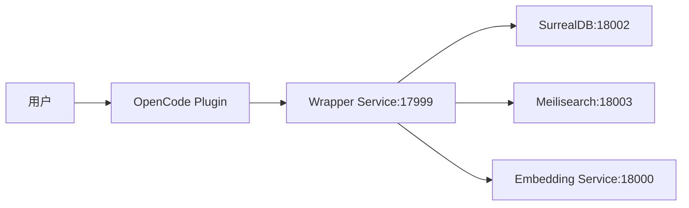

# 📚 OpenCode Memory Plugin - 架构文档

**版本**: v2.1.0  
**状态**: 实施中  
**项目**: @csuwl/opencode-memory-plugin
**更新时间**: 2026-03-12

---

## 📋 架构概览

### 统一 API 入口

插件仅通过 **Wrapper 服务（端口 17999）**访问所有后端功能，不再直接访问 Embedding 服务或 Meilisearch。

```javascript
// 用户请求 → 插件 → Wrapper 服务
Wrapper Client (localhost:17999)
  ├─ POST /api/v1/memories/search  // 搜索记忆
 ├─ POST /api/v1/memories         // 上传记忆
 ├─ POST /api/v1/memories/relations  // 创建关系
 ├─ POST /api/v1/memories/{id}/relations // 查询关系
 ├─ DELETE /api/v1/memories/relations/{id}  // 删除关系
 ├─ POST /api/v1/memories/{id}/graph  // 图遍历
 └─ WebSocket /ws/memories/live      // 实时推送
```

### 服务职责划分

| 服务             | 端口  | 职责              | 说明                    |
| ---------------- | ----- | ----------------- | ----------------------- |
| **Wrapper 服务** | 17999 | 统一 API 网关     | ✅ 对外提供所有功能     |
| Embedding 服务   | 18000 | 向量生成          | ⚠️ 内部服务，不对外暴露 |
| LLM 服务         | 18001 | 文本生成          | ⚠️ 内部服务，不对外暴露 |
| SurrealDB        | 08002 | 向量存储 + 图关系 | ⚠️ 内部服务，不对外暴露 |
| Meilisearch      | 18003 | 全文搜索          | ⚠️ 内部服务，不对外暴露 |

### 数据流



---

## 🔒 安全架构

### 单一入口点

✅ **仅 Wrapper 服务对外暴露**（端口 17999）

- 所有请求通过 Wrapper 服务认证和路由
- 内部服务（18000, 18001, 18002, 18003）仅监听本地回环地址
- 无需配置额外的防火墙规则

### 服务隔离

- **网络隔离**: 内部服务仅监听 localhost
- **认证隔离**: Wrapper 服务统一管理认证逻辑
- **依赖隔离**: Embedding 服务仅被 Wrapper 调用

### 权限控制

- **当前状态**: 所有端点公开访问
- **未来计划**: 添加 API Key 认证机制

---

## 📦 可用工具（更新）

| 工具                   | 功能          | 状态    | 后端依赖            |
| ---------------------- | ------------- | ------- | ------------------- |
| `memory_write`         | 写入记忆      | ✅ 正常 | ✅ Wrapper 服务     |
| `memory_read`          | 读取记忆文件  | ✅ 正常 | - 本地文件          |
| `memory_search`        | 关键词搜索    | ✅ 正常 | ✅ Wrapper 服务     |
| `list_daily`           | 列出日志      | ✅ 正常 | - 本地文件          |
| `init_daily`           | 初始化日志    | ✅ 正常 | - 本地文件          |
| `rebuild_index`        | 同步到后端    | ✅ 正常 | ✅ Wrapper 服务     |
| `index_status`         | 状态检查      | ✅ 正常 | ✅ Wrapper 服务     |
| `memory_relate`        | 创建/查询关系 | ✅ 正常 | ✅ Wrapper 服务     |
| `memory_graph`         | 图遍历        | ✅ 正常 | ✅ Wrapper 服务     |
| `vector_memory_search` | ❌ 已移除     | ❌ -    | ️ 改用 memory_search |

**移除的工具**:

- ❌ `vector_memory_search` - 已移除（统一使用 `memory_search`）
- ❌ 直接访问 Embedding 服务的代码 - 已移除

---

## 🔧 配置说明

### 环境变量

| 变量名               | 说明         | 默认值                   |
| -------------------- | ------------ | ------------------------ |
| `MEMORY_BACKEND_URL` | 后端服务地址 | `http://localhost:17999` |
| `MEMORY_TENANT_ID`   | 租户 ID      | `default`                |

### 配置文件（~/.opencode/memory/memory-config.json）

```json
{
  "version": "2.1.0",
  "search": {
    "mode": "hybrid"
  },
  "backend": {
    "enabled": true,
    "url": "http://localhost:17999",
    "tenant_id": "default"
  },
  "auto_save": true,
  "consolidation": {
    "enabled": true,
    "run_daily": true
  }
}
```

---

## 🚀 快速开始

### 安装

```bash
npm install -g @csuwl/opencode-memory-plugin
```

### 验证安装

```bash
# 启动 OpenCode
opencode

# 验证后端服务
index_status
```

### 使用示例

```bash
# 写入记忆
memory_write content="用户偏好 TypeScript" type="preference" tags=["typescript","code-style"]

# 搜索记忆
memory_search query="async patterns" mode="hybrid"

# 创建关系
memory_relate from_id="id1" to_id="id2" relationship_type="related"

# 图遍历
memory_graph memory_id="id1" depth=2
```

---

## 📊 版本历史

### v2.1.0 (2026-03-12)

**重大变更**:

- 🏗️ **架构重构**: 统一 API 入口，仅通过 Wrapper 服务（17999）访问
- ❌ 移除 `vector_memory_search` 工具
- ❌ 移除直接访问 Embedding 服务的代码
- ✅ 删除未使用的 `embedding` 配置
- ✅ 简化配置文件结构

**影响**:

- 所有搜索功能通过 `memory_search` 统一调用
- Embedding 服务（18000）成为内部服务
- 安全性提升：单一入口点

### v2.0.0 (2026-02-26)

**初始版本**:

- ✅ 后端 SurrealDB 集成
- ✅ 10 个记忆工具
- ✅ OpenClaw 风格记忆文件
- ✅ 向量搜索 + 关键词搜索
- ✅ 图关系支持

---

## 🎯 核心价值

### 简化

✅ **统一接口** - 所有操作通过 Wrapper 服务
✅ **清晰架构** - 明确的职责划分
✅ **易于维护** - 减少服务间依赖

### 安全

✅ **单一入口** - 简化认证和授权
✅ **服务隔离** - 内部服务仅本地访问
✅ **可扩展** - 易于添加新功能

---

## 🔗 相关链接

- [项目 README](../README.npm.md)
- [配置指南](../CONFIGURATION.md)
- [后端服务文档](../../embedding_service/README.md)

---

_最后更新: 2026-03-12_

> **版本**: 1.0.0  
> **状态**: 实施中  
> **最后更新**: 2026-03-01  
> **项目**: @csuwl/opencode-memory-plugin

---

## 📋 概述

本文档定义了 OpenCode Memory Plugin 项目的**代码质量检查标准**，旨在：

1. **规范项目开发** - 为团队提供统一的开发规范
2. **保证代码质量** - 通过自动化工具确保代码符合最佳实践
3. **提高可维护性** - 统一的代码风格和结构
4. **防止安全问题** - 自动检测密钥泄露和安全漏洞

### 🌐 技术栈

- **语言**: JavaScript (ES Modules)
- **运行时**: Node.js 16+
- **包管理器**: npm
- **模块系统**: ES Modules (type: "module")

---

## 🗂️ 文档结构

| 章节               | 文件                               | 说明                          |
| ------------------ | ---------------------------------- | ----------------------------- |
| 1. 总则与原则      | `01-GLOBAL-PRINCIPLES.md`          | 适用范围、核心原则、规范层级  |
| 2. 代码格式化规范  | `02-FORMATTING-STANDARDS.md`       | JavaScript/Node.js 格式化规则 |
| 3. 代码检查规范    | `03-LINTING-STANDARDS.md`          | ESLint 配置、错误检测         |
| 4. 类型检查规范    | `04-TYPE-CHECKING-STANDARDS.md`    | TypeScript 类型检查配置       |
| 5. 安全扫描规范    | `05-SECURITY-SCANNING.md`          | 密钥检测、代码安全            |
| 6. 测试规范        | `06-TESTING-STANDARDS.md`          | 测试框架、覆盖率要求          |
| 7. Pre-commit 规范 | `07-PRECOMMIT-STANDARDS.md`        | Git hooks 配置                |
| 8. CI/CD 集成规范  | `08-CICD-INTEGRATION-STANDARDS.md` | Pipeline 结构                 |
| 9. 依赖管理规范    | `09-DEPENDENCY-STANDARDS.md`       | 版本选择、漏洞检查            |
| 10. 开发流程规范   | `10-DEVELOPMENT-WORKFLOW.md`       | 提交规范、分支策略            |
| 11. 工具链配置     | `11-TOOLCHAIN-CONFIG.md`           | 完整配置文件模板              |
| 12. 实施计划       | `12-IMPLEMENTATION-PLAN.md`        | 分阶段实施计划                |

---

## 🚀 快速开始

### 步骤 1: 安装依赖

```bash
cd opencode-memory-plugin
npm install
```

### 步骤 2: 安装 Pre-commit Hooks

```bash
npx husky install
npx husky add .husky/pre-commit "npx lint-staged"
```

### 步骤 3: 运行代码检查

```bash
# 检查所有文件
npm run lint

# 自动修复问题
npm run lint:fix

# 格式化代码
npm run format

# 类型检查
npm run type-check
```

---

## 📊 规范层级

```
┌─────────────────────────────────────────────┐
│  Level 1: 总则与原则                          │
│  - 适用范围、核心原则、团队文化               │
└─────────────────────────────────────────────┘
            ↓
┌─────────────────────────────────────────────┐
│  Level 2: 技术规范                            │
│  - 格式化、检查、类型检查、测试              │
│  - 安全扫描、依赖管理、CI/CD                 │
└─────────────────────────────────────────────┘
            ↓
┌─────────────────────────────────────────────┐
│  Level 3: 实施指南                            │
│  - Pre-commit、CI/CD、开发流程               │
│  - 工具链配置、最佳实践                      │
└─────────────────────────────────────────────┘
```

### 规范优先级

| 优先级 | 类别       | 说明               | 违规后果             |
| ------ | ---------- | ------------------ | -------------------- |
| **P0** | 安全扫描   | 必须通过，阻止提交 | 密钥泄露、安全漏洞   |
| **P1** | 类型检查   | 必须通过，阻止提交 | 类型错误、未定义变量 |
| **P2** | 代码格式化 | 自动修复，可豁免   | 格式不一致           |
| **P3** | 代码检查   | 警告级别，建议修复 | 代码异味、复杂度     |
| **P4** | 测试覆盖   | 阶段性目标         | 覆盖率不足           |
| **P5** | 文档规范   | 辅助性要求         | 注释不完整           |

---

## 🎯 核心价值

### 1. 统一性

✅ **统一的代码风格** - 所有开发者遵循相同规范  
✅ **一致的工具配置** - 避免因个人偏好导致的混乱  
✅ **标准化的检查流程** - 从开发到部署的全程质量保证

### 2. 自动化

✅ **自动化检查** - 减少人工审查的工作量  
✅ **即时反馈** - 开发者提交前就能发现问题  
✅ **持续监控** - CI/CD 管道自动执行所有检查

### 3. 可维护性

✅ **清晰的规则定义** - 新成员快速上手  
✅ **可扩展的架构** - 新项目快速复制配置  
✅ **版本化的规范** - 规则演进可追溯

### 4. 安全性

✅ **密钥泄露防护** - 自动检测敏感信息  
✅ **代码安全扫描** - 发现潜在漏洞  
✅ **依赖漏洞检查** - 自动更新有漏洞的依赖

---

## 📞 相关资源

### 外部参考

- [Airbnb JavaScript Style Guide](https://github.com/airbnb/javascript) - JavaScript 最佳实践
- [Google JavaScript Style Guide](https://google.github.io/styleguide/jsguide.html) - Google JS 规范
- [Node.js Best Practices](https://github.com/goldbergyoni/nodebestpractices) - Node.js 最佳实践

---

## 📄 文档信息

- **文件名**: `README.md`
- **版本**: 1.0.0
- **许可证**: MIT

---

## 🔗 快速链接

- [总则与原则](./01-GLOBAL-PRINCIPLES.md)
- [代码格式化规范](./02-FORMATTING-STANDARDS.md)
- [代码检查规范](./03-LINTING-STANDARDS.md)
- [Pre-commit 规范](./07-PRECOMMIT-STANDARDS.md)
- [工具链配置](./11-TOOLCHAIN-CONFIG.md)
- [实施计划](./12-IMPLEMENTATION-PLAN.md)
